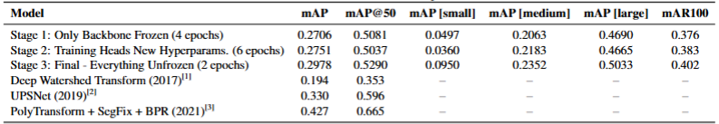

## General Description 📝
This repo contains training code and training steps for finetuning of Masked R-CNN to the Cityscapes dataset. Cityscapes is a dataset that consists of urban scenes from diverse German cities and provides a good benchmark for instance segmentation/object detection models. We have selected Masked R-CNN for this task for educational purposes - Masked R-CNN is a foundational model for newer and stronger implementations and demonstrates lots of key computer vision concepts such as backbone extracted features, non-maximum supression, region proposal network (RPN) and mask head. We have reached test set mAP that is below SOTA but is respectable considering that Masked R-CNN is almost 10 years old.

This project was done by Ben Sebastian Attias and Timur Oner for course Vision and Cognition Systems 2024/2025@UniPD.

Coding And Data Preparation - Timur Oner

Project Idea And Experiment Design - Timur Oner and Ben Attias

Compuet and Storage Costs - Timur Oner And Ben Attias

Final Report - Timur Oner and Ben Attias

Repo Organization - Timur Oner

Final Presentation - Timur Oner and Ben Attias

## Dataset Description 🗂️
We use the Cityscapes dataset [4], a large-scale dataset
 that contains diverse urban scenes from various German
 cities. It consists of more than 3000 high-quality images
 (2048px by 1024px) with instances of objects that are com
monly encountered during driving (pedestrians, cars etc.)
 and their respective instance annotations and pixel-level in
stance segmentation masks. There are also more than 20000
 semantically annotated images that can be used for seman
tic annotation and pre-training tasks.
 For our experiments, 2,975 finely annotated images are
 used for training and 500 for validation. Of the dataset,
 1,525 images are reserved for benchmarking and lack pub
lic labels, so they were excluded from training. The coarse
 annotations from the trainextra split were utilized to
 provide additional semantically annotated samples that we
 used to pretrain resnet50 backbone that we used in our Mask
 R-CNN implementation. Due to storage and memory con
straints, we used only 4120 coarsely annotated images.

## The Training Procedure 
The training was done in 3 stages on a Nvidia L4 gpu in Colab environment. 

**Stage 0 – Backbone Pre-training**  
- Initialized ResNet50 backbone with DeepLabv3 weights for richer feature representations.  
- Pre-trained on 4,120 semantically annotated images from Cityscapes train-extra for 12 epochs using cross-entropy loss and Adam optimizer.  
- ReduceLROnPlateau scheduler used; convergence not fully reached due to compute limits.  

**Stage 1 – FPN & Head Training**  
- Backbone frozen; trained FPN, RPN, RoIAlign, and heads on full training set (2,975 images) for 4 epochs.  
- Minimal fine-tuning; unfreezing the backbone caused overfitting.  

**Stage 2 – Hyperparameter Tuning & Training**  
- Tuned key hyperparameters with Optuna on a reduced subset: foreground IoU threshold, RPN positive/negative IoU thresholds, and FPN gradient flow.  
- Anchors adapted via k-means clustering on bounding boxes.  
- Best configuration applied; model trained for 6 epochs with backbone frozen.  

**Stage 3 – Final Refinement**  
- Fully unfroze the network and trained on validation partitions to let all components adapt to each other.  
- Learning rate reduced by factor of 10 to prevent overfitting.  

## Challenges Encountered 🛠️

1. The training and testing data consists of high-quality RGB images (1024x2048px). While having such high quality data is great for better generalization, it also increases size of each training sample. Such a      RGB image typically has size of about 25mb. Having such large limits the size of each batch during training, makes training and inference considerably slower and potentially requires high RAM/disc capacities      for storage and manipulation. Even though a batch with size of 4 appears to have only 100mb of size, if we consider the model weights, gradients and activation the required amount of VRAM easlity reaches 12-15
   GB. Since the training was done on a Nvidia L4, the highest batch size we could afford was 4.
2. When training Masked R-CNN with all layers unfrozen from initialization, we observed severe overfitting behavior. Both training and validation losses decreased rapidly in the first few epochs, but validation      loss quickly plateaued while training loss continued declining, indicating poor generalization. Experiments with various learning rates (1e-3 to 1e-5) and weight decay values (1e-4 to 1e-2) failed to mitigate     this issue.
   We hypothesize that this occurs due to catastrophic forgetting of the pretrained backbone representations. The ResNet-50 backbone, when allowed to update freely on the relatively small Cityscapes dataset          (2,975 training images compared to ImageNet's 1.2M), rapidly overfits to dataset-specific patterns and forgets the general low-level feature representations (edges, corners, textures) acquired during ImageNet     pretraining. This feature degradation causes the model to lose its generalization capability despite improving on the training set.

3. The Cityscapes dataset includes samples with a big amount of small and occluded objects as seen in Table 1. This makes reaching good overall mAP much trickier even for state-of-the-art models. We pretreined       Resnet-50 backbone to allow the backbone to produce better features but still the small object performance is lacking. Using a better backbone like resnet101 will probably improve overall mAP along with small
   object mAP but we think that it is quite difficult to go above a certain performance level without switching to a newer and more capable model.

4. Since training time for Cityscapes was quite high (around 7 hours for training on the full dataset), we had to use only 372 images for the hyperparmeter sweep. In addition, to reduce total number of    
   hyperparamters to be optimized the anchor sizes and aspect ratios were selected by k-means clustering. 
   

## The Final Test Set Metrics 📊
In the table below the test set metrics after each training stage is displayed along with 2 examples of recent instance segmentation models. Since the motive of this project was more educational and exploratory and we used a much older implementation this gap is expected. 

## Future Projects 🚀

For future, experimentation with SOTA architectures and trying new techniques to drammatically reduce VRAM and trainin time requirements while keeping test set performance high is planned. Another interesting angle worth exploring is being able to prune and compress computer vision models for edge operation. My next implementation will probably explore how to deploy SOTA models using less memory possibl and exploring new inference techniques to achieve real time image segmentation without compromising the accuracy and precision much. 

## Inference Examples

[1] Tang, C., Chen, H., Li, X., Li, J., Zhang, Z., & Hu, X. (Year). Look closer to segment better: Boundary patch refinement for instance segmentation. State Key Laboratory of Intelligent Technology and Systems, THU-Bosch JCML Center.

[2] Xiong, Y., Liao, R., Zhao, H., Hu, R., Bai, M., Yumer, E., & Urtasun, R. (2019). UPSNet: A Unified Panoptic Segmentation Network. CVPR 2019.

